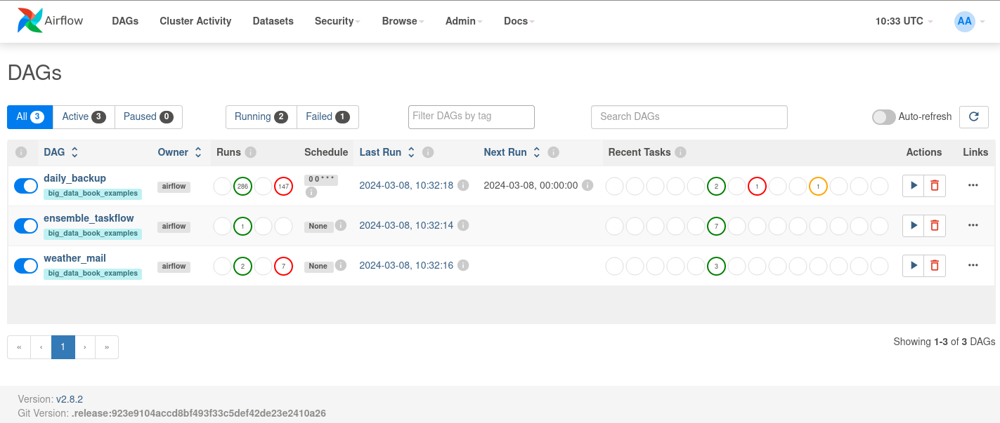

# Apache Airflow Programming Examples

Three DAGs have been included as Airflow's examples:

- _daily_backup_: starting on January 1, 2023, and running once a day. 
Four tasks, all of them running a different bash script, are defined. A relationship between tasks
 is denoted by the symbol >> to establish a dependency and determine the sequence of task execution.
- _weather_mail_: an HTTP endpoint is periodically queried to get information about the current weather in a location identified by its geographical coordinates (i.e., *longitude*, *latitude*).
This operation is carried out by the ``SimpleHttpOperator``, which performs a *GET* request toward the specified endpoint using a given query
string. Then, the ``PythonOperator`` takes the HTTP response obtained by
``SimpleHttpOperator`` and properly formats it to build the body of the
message, which will be inserted into the email sent by the ``EmailOperator``.
- _ensemble_taskflow_: Airflow’s TaskFlow APIs are used to implement an *ensemble learning* application leveraging the *voting* technique. Specifically, an ensemble method is built by fitting a set of base classifiers on training data, which performs classification on test instances by voting on the predictions made by each classifier.

## How to run

Use the Airflow UI to run DAGs and to monitor results. Since this project is primarily for testing purposes,
the credentials for the Airflow UI have been set as follows: 
- USERNAME=_**admin**_
- PASSWORD=_**admin**_

DAGs are automatically loaded at startup and shown in the Airflow UI (http://localhost:8881/home):



--- 

> **_NOTE:_**  The _weather_mail_ DAG includes a task 
> that involves sending an email. To enable correct sending of emails, 
> you must correctly configure an SMTP server (e.g., Gmail) in the _**airflow.cfg**_ file. 
> ````
> [smtp]
> smtp_host = <host>
> smtp_starttls = True
> smtp_ssl = False
> smtp_user = <user>
> smtp_password = <password>
> smtp_port = <port>
> smtp_mail_from = <sender_email>
> ````
